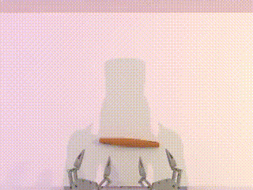

# T2 阶段记录：grab_roller

这是 TronCamp Mani T1-T4 综合项目中的第二阶段记录，任务是 T2 `grab_roller`。该阶段开始从单臂任务进入双臂协同操作，重点验证 ACT 在更长动作序列、双腕相机和轻量随机化数据上的泛化能力。

## 任务信息

- 赛道：T2
- 任务：`grab_roller`
- 策略：ACT baseline，后续准备对比 InterACT
- 本地演示数据：400 episodes
- 训练 seed：0
- 训练配置：`chunk_size=50`、`hidden_dim=512`、`kl_weight=10`、`lr=1e-5`
- 最佳验证损失：0.029596，出现在 epoch 2457

## Baseline 本地公开 seed 评估

评估使用官方本地评估入口，在公开 100 seed 上执行，`repeats=1`。

```json
{
  "sr": 0.53,
  "n_repeats": 1,
  "n_episodes": 100,
  "per_repeat": [0.53],
  "track": "T2"
}
```

结论：400 条轨迹训练出的 ACT baseline 已经能完成一部分双臂抓举场景，但 `sr = 0.53` 距离 60% 目标仍有差距。后续优化方向不是只看 validation loss，而是用公开 seed rollout 成功率直接筛选 checkpoint 和训练设置。

## T2 成功采集示例

下面是一次 T2 `grab_roller` 成功专家/数据采集样例，用于展示任务形态和数据来源。



原始 MP4：[`media/t2_collect_success_grab_roller_episode1.mp4`](../media/t2_collect_success_grab_roller_episode1.mp4)

该视频来自本地采集数据中的成功 episode，不是当前 ACT policy 的闭环部署视频。策略部署视频会在 T2 达到更稳定成功率后单独补充。

## 当前优化

T2 baseline 暴露出的主要问题是泛化不足：训练验证损失已经较低，但 public seed rollout 成功率没有稳定超过 60%。因此当前追加了一轮轻量视觉增强训练：

- 只对 train dataset 做亮度、对比度、饱和度扰动。
- validation dataset 保持干净，避免 best checkpoint 选择被随机增强噪声污染。
- 不把 checkpoint、processed data 或训练日志放入 GitHub。

如果增强训练仍不能稳定超过 60%，下一步会优先补充演示数据到 600/800 条，而不是继续盲目调大模型。

## 未公开的本地文件

以下内容没有放入 GitHub：

- 采集到的 `.hdf5` 演示数据
- ACT processed data
- `.ckpt` checkpoint
- 本地训练和评估日志
- 官方提交 token 或其他凭据
